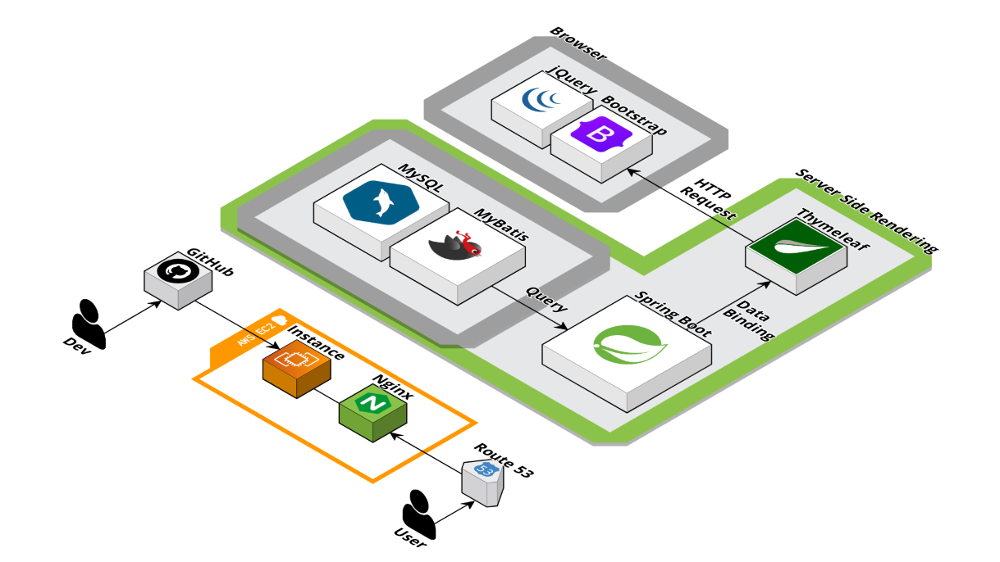
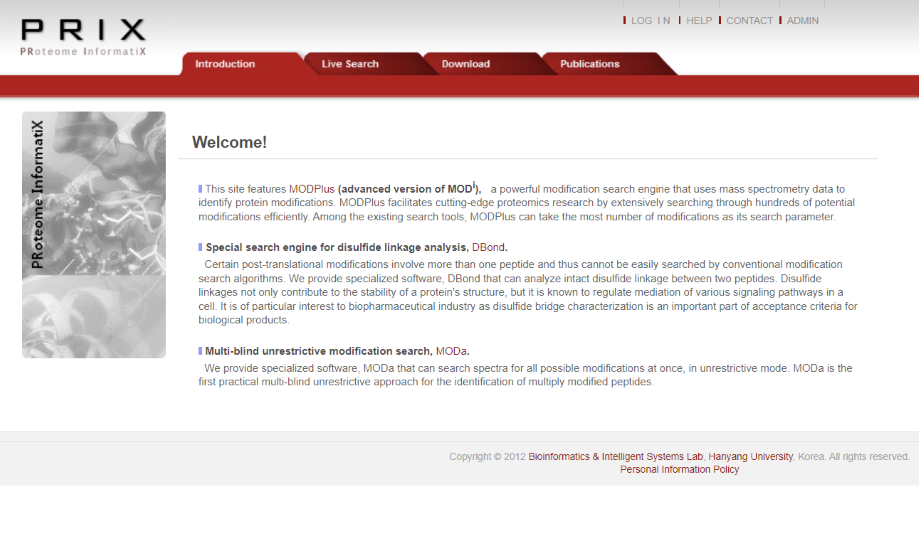

# JSP 기반 웹 시스템의 HTML5 환경 전환 프로젝트

**📌 개인 프로젝트 | 학부 졸업 프로젝트**

기존 JSP 기반 교수 연구실 웹사이트의 유지보수성과 확장성을 개선하기 위해 HTML5 기반 환경으로 전환하고, Spring 프레임워크를 활용해 구조를 재설계한 프로젝트입니다.

---

## 🔧 사용 기술 스택

- Java 17
- Spring Boot
- MyBatis
- MySQL
- Thymeleaf
- Gradle
- Tomcat 8

---

## 1. 프로젝트 개요

기존 시스템은 JSP 기반으로 구성되어 있었으며, 문서화가 부족해 유지보수가 어려운 상태였습니다. 본 프로젝트는 이를 HTML5 환경으로 전환하고, Spring MVC 구조를 적용하여 코드 구조를 명확히 재정비한 개인 프로젝트입니다.

---

## 2. 주요 기술 및 아키텍처

- Controller / Service / Repository 계층 분리 (Spring MVC)
- 사용자 인증 및 접근 권한 분리 (Spring Security)
- MyBatis를 활용한 DB 연동
- Thymeleaf 기반의 템플릿 구성
- Gradle 기반 빌드 환경 + Tomcat 서버

### 🔽 아키텍처 구성도

---

## 3. 핵심 기능 요약

- 로그인 / 로그아웃, 세션 기반 권한 분리
- 관리자 페이지, 게시판, 파일 업로드 기능 구현
- 화면 구성 템플릿화로 코드 중복 제거 및 유지보수성 향상

### 🔽 실행 화면

> 

---

## 4. 기술적 어려움과 해결

| 문제 | 해결 방식 |
|------|------------|
| 문서화되지 않은 JSP 코드로 인해 로직 해석 어려움 | 전체 기능 흐름을 직접 정리하고 모듈 단위로 기능을 분리 |
| 인증 및 권한 제어 미비 | Spring Security를 도입해 사용자/관리자 권한 제어 로직 구현 |
| 코드 중복과 유지보수 어려움 | Thymeleaf 템플릿화 및 MVC 구조 재정비로 구조 간결화 |

---

## 5. 결과 및 배운 점

- 단순히 작동하는 프로그램을 만드는 것을 넘어, 구조적 완성도와 유지보수성을 고려한 개발의 중요성을 체감했습니다.
- 사용자 경험을 개선하는 기능 개선 방향을 고민하고 구현한 경험을 통해, 사용자 중심의 개발 태도를 배울 수 있었습니다.
